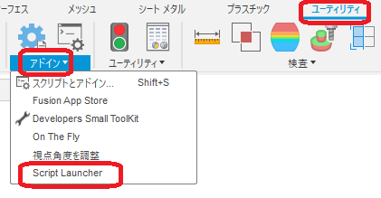

# ***Fusion360 ScriptLauncher***
This is an add-in for the Autodesk software Fusion360.

A tree-like menu to simplify the sequential execution of scripts.

---

## **Installation**:

To install, download/extract the zip file and register the "ScriptLauncher" folder as an **add-in**.

To register add-ins, follow the instructions [here](https://knowledge.autodesk.com/support/fusion-360/troubleshooting/caas/sfdcarticles/sfdcarticles/How-to-install-an-ADD-IN-and-Script-in-Fusion-360.html).

---
## **usage method**:

- After launching the add-in, the "Script Launcher" command will be added in "Utilities" - "Add-Ins".

- After executing the command, a dialog box will appear, displaying a menu divided into a tree with numbers, each letter of the alphabet, and others.

  - Scripts marked with ☆ are installed by default.

- The scripts that will be registered in the menu are all the scripts listed in the "Scripts" tab of the "Scripts and Add-Ins" menu.

- Double-clicking on any script executes the corresponding script.

---

## **Action** :

The following environment is confirmed.

- Fusion360 Ver2.0.18719
- Windows10 64bit Home

---

## **License**:
- Apache License 2.0

---
---

# *** 以下は日本語です。***

このアドインは、Fusion360用アドインです。

スクリプトの連続実行を簡素化する為のツリー状のメニューです。

---

## **インストール**:
インストールする際は、zip ファイルをダウンロード/展開後 "ScriptLauncher" フォルダを **アドイン** として登録してください。

アドインの登録は、[こちら](https://kantoku.hatenablog.com/entry/2021/02/15/161734)の手順に従ってください。

---
## **使用法**:

- アドイン起動後は、"ユーティリティ" - "アドイン" 内に "Script Launcher" コマンドが追加されます。

- コマンド実行後はダイアログが表示され、数字・各アルファベット・その他でツリー分けされたメニューが表示されます。

  - ☆印はデフォルトでインストールされているスクリプトです。

- メニューに登録されるスクリプトは、"スクリプトとアドイン"の"スクリプト"タブで表示されている全てのスクリプトです。

- 任意のスクリプトをダブルクリックする事で、該当するスクリプトが実行されます。

---

## **アクション**:
- Fusion360 Ver2.0.18719

- Windows10 64bit Home

---

## **ライセンス**:
- Apache License 2.0

---

## **謝辞** :

- [日本語フォーラム](https://forums.autodesk.com/t5/fusion-360-ri-ben-yu/bd-p/707)の皆さん、ありがとう。
